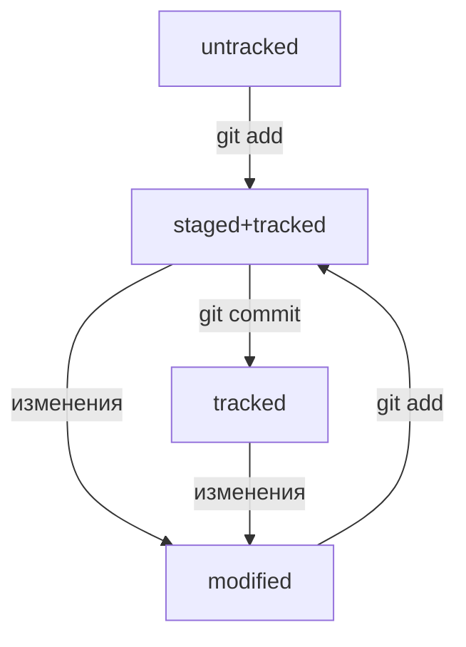

# Работа с командной строкой:

## Работа с файлами и папками:
* cd путь_к_папке - перейти в указанную папку
* ls -  вывести на экран содержимое текущей папки
* pwd - вывести название текущей директоиии
* open - открыть файл
* cp - копировать файл
* mv - переместить файл
* touch - создать файл
* mkdir - создать директорию
* cp - копировать файл
* mv - переместить файл
* mvdir - удалить папку
* cat - распечатать
* echo - записать в файл

---

## Работа с  git:
* git init - начать отслеживать изменения в каталоге
* git add - приготовить к коммиту
* git commit - закоммитить
* git remote add - наладить связь с удаленным каталогом
* git push - отправить данные на удаленный репозиторий

## Хеш коммита
Хеш коммита - уникальная 40-значная последовательность цифр и английских букв, однозначно идентифицирующая коммит.

## HEAD
Файл внутри папки .git, который хранит ссылку на информацию о последнем коммите

## Git log
Если указать у git log параметр --oneline, то иформация о коммитах будет выведена списком, состоящим из строк. Каждая строка начинается с части хеша (несколько первых символов хеша коммита)

## Статусы файлов в git

